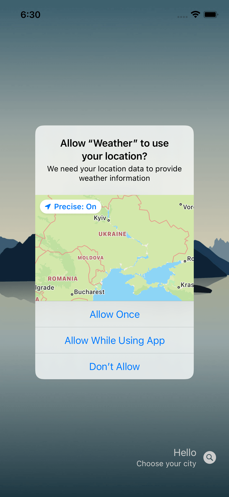
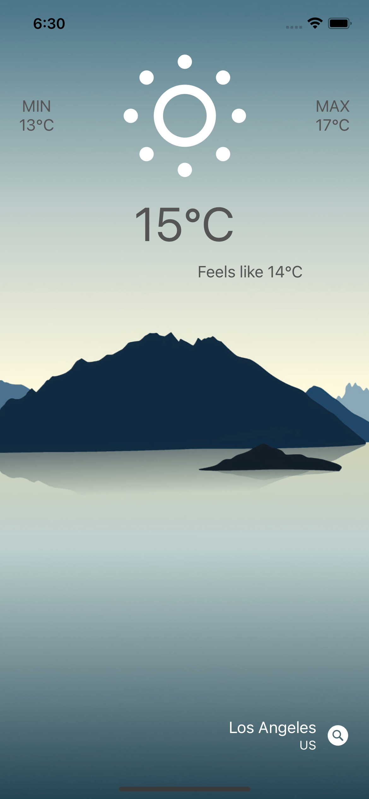
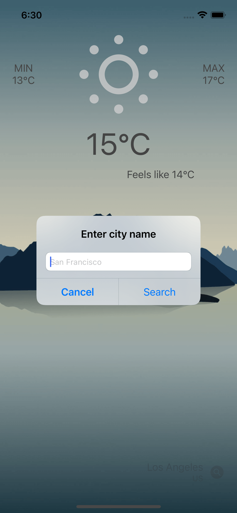

# Weather
Weather App

Created by using UIKit without Storyboard. I also used CoreLocation and API https://openweathermap.org

You can let app use your location to check weather or choose any city

App can show incorrect minimum, maximum and feels like temperatures because I use free version of API

  
